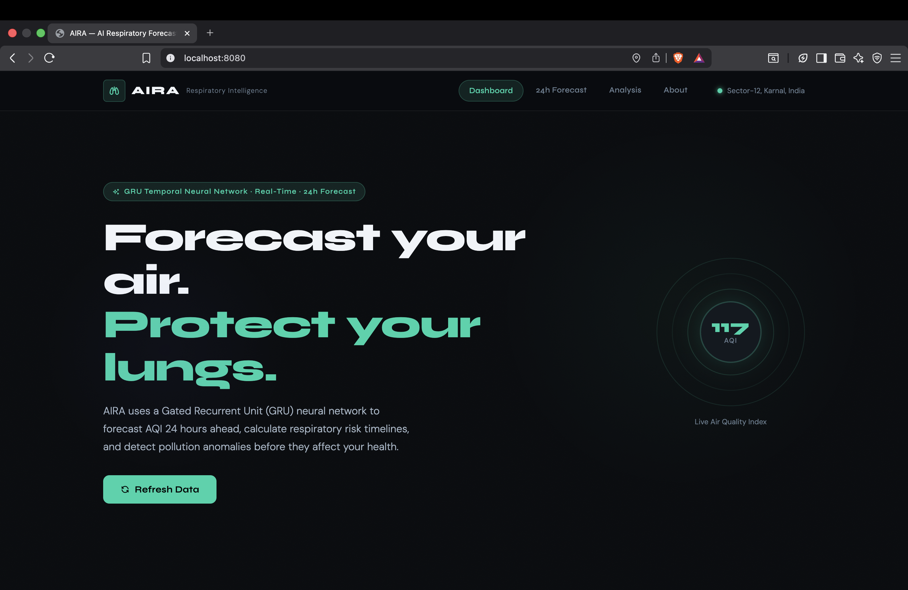
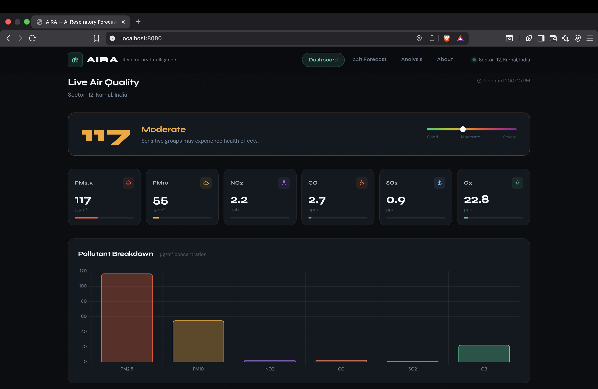
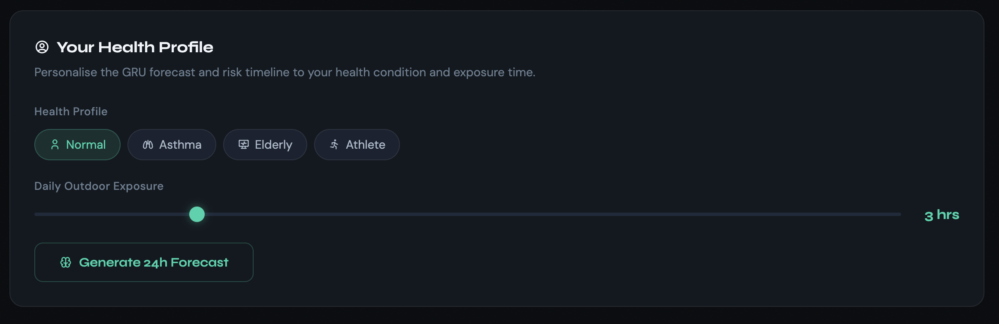
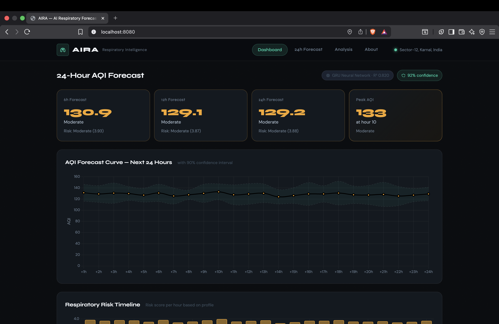
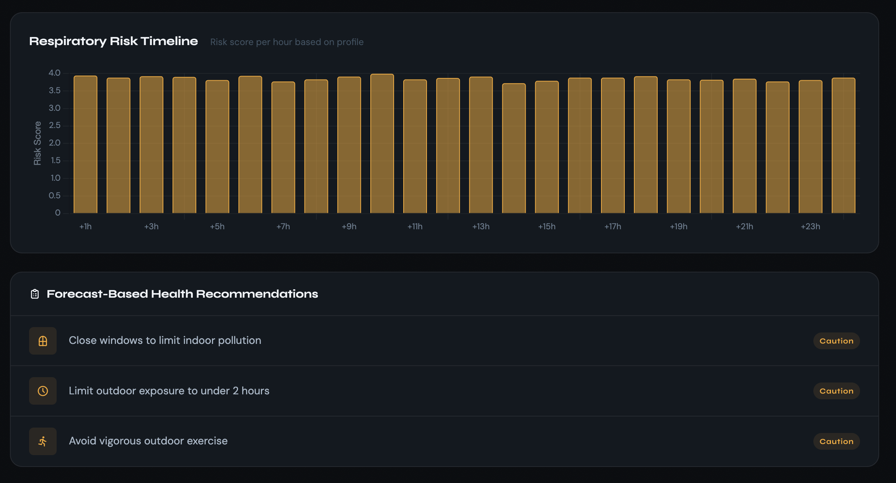
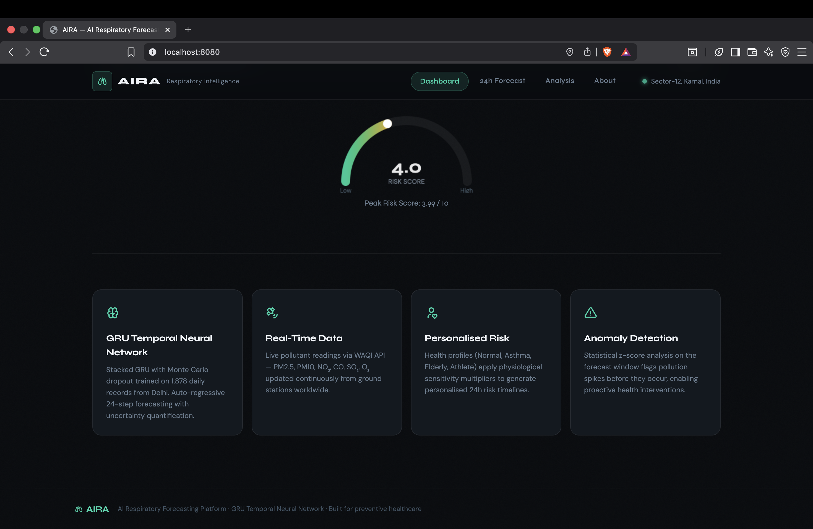

# AIRA — AI Respiratory Intelligence & Risk Assessment

## Objective

Develop an AI-powered respiratory health assistant capable of forecasting air quality 24 hours in advance and estimating personalized respiratory health risks.

---

## Problem Statement

Air pollution causes severe respiratory issues and existing AQI systems only provide current conditions without forecasting future risk.

AIRA addresses this limitation by combining:

- Real-time AQI monitoring
- Deep learning forecasting
- Personalized health risk analysis
- Preventive recommendations

---

## Methodology

### Data Collection

- WAQI API
- Historical AQI datasets

### Model

GRU (Gated Recurrent Unit) Neural Network

### Forecasting

- 24-hour AQI prediction
- Monte Carlo Dropout uncertainty estimation
- Anomaly detection

### Risk Assessment

Inputs:

- Forecast AQI
- Exposure duration
- Health profile

Outputs:

- Risk score
- Risk category
- Health recommendations

---

## Features

- Real-time AQI monitoring
- AQI forecasting
- Pollution spike detection
- Personalized respiratory risk timeline
- Interactive dashboard
- Confidence interval visualization

---

## Technologies Used

- Python
- Flask
- TensorFlow
- Scikit-Learn
- HTML
- CSS
- JavaScript
- Chart.js

---
## Screenshots

### Homepage

### Live AQI Dashboard

### Health Profile Configuration

### 24-Hour AQI Forecast

### Risk Timeline & Recommendations

### Risk Gauge & System Features

## Future Scope

- Mobile application
- Weather-aware forecasting
- AQI notifications
- Cloud deployment
- Multi-city forecasting

---

## Author

Arnav Kakkar & Daksha Gulati